# WeaklySupervisedLearning

This is a small tensorflow based framework written for Python3 intended for playing around with different weakly supervised deep learning algorithms. Given images and class level labels, the algorithms attempt to not only classify the object(s) in the image correctly, but also to localize them. The framework has the following structure:

## Components

### Manager
Class that is responsible to connect all the subcomponents: loading data, creating model, training model and evaluating the trained model.

### DataLoader
Class that is responsible for loading the .npz data and feeding it back to the manager.

### GraphBuilder
Class that is responsible for creating the tensorflow model, by initiliazing the model class with the specified parameters.

#### HelperCNN
Small CNN helper class used for creating convolutional networks needed within the weakly supervised models.

### Network
Class that is responsible for doing the training and creating the tensorflow summary file.

### Evaluation
Class that loads trained model and evaluates the perfomance on the dataset (e.g. accuracy, IoU), and also saves out visualization of the detection performance in the specified way (e.g. bounding box, circle,..).

### Configuration
Configuration of the training process can be done in the config.xml.

## Getting Started 

Before starting the code, configure the framework to your needs in the ./Configuration/config.xml. Having done that, just start by running the *manager.py* file.

## Prerequisities:

The following packages are required in order to run the code:
  - tensorflow (>= 1.4.0)
  
The following required packages should come automatically with your python distribution:
  - numpy (>= 1.13.3)
  - matplotlib

## Implemented Networks

Currently there are two implemented networks.

### Deep Recurrent Attentive Detector (DRAD)

DRAD was inspired by the following paper: https://arxiv.org/abs/1502.04623. It is a recurrent network with an integrated attention mechanism. The architecture is the following:

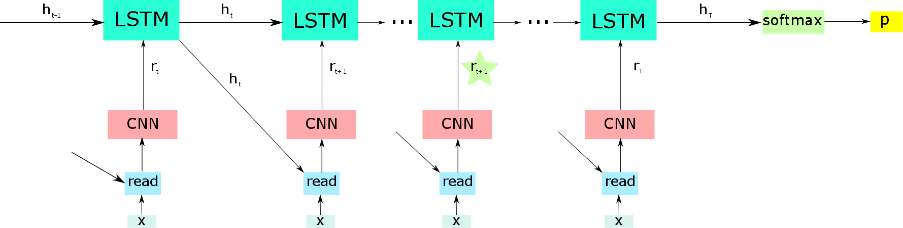

The basic workflow is the following:
  - At each timestep, feed in the original image *x*.
  - Perform the read operation on the original image which will, under the consideration of the history state of the LSTM, output a location and a Gaussian kernel size.
  - Using this location and Gaussian kernel size, a blurred image patch of predefined size (which defines the attention size) is extracted and fed into the CNN, which extracts a feature vector *r* that is passed on to the LSTM.
  - The LSTM uses the combination of the previous history vector *h* and the feature vector *r* to decide where to look next for the object.
  
Thus, using a Gaussian attention mechanism in combination with CNNs and RNNs, the network will at each timestep move closer to the object in the image to be able to correctly classify the image, at least ideally. The classification result is taken from the output of the softmax layer at the last RNN unfolding, while the localization is the image patch extracted where the LSTM output the highest confidence for the chosen class.
See below for an example series, where the blue rectangle signifies the current attention patch and the red rectangle would be the optimal bounding box. The yellow bounding box is the one that is chosen by the model.

### Self Transfer

The self transfer model is an implemented tensorflow version of the following paper: https://arxiv.org/abs/1602.01625. Its basic idea is to train a CNN that in the final layers forks into a classification output layer and a localization output layer. Both layers have a classification loss function, which is linearly combined. By tracing back the highest activations from the localization input, it is possible to visualize the area in the image that was a major cause for the classification decision. Thus, it is possible to obtain the object location just by using class labels. 
NOTE: This model only runs on GPU currently as the tf.nn.max_pool_with_argmax method only runs on GPU.

## Available Datasets

For quick testing of the implemented models, two datasets were used: cluttered MNIST and embedded MNIST. However, due space restrictions on github, I only uploaded a very small fraction of them. If needed, I will be happy to make them fully available to you (just send me an email for that).

### Cluttered MNIST

This is a very simplistic toy example serving as a sanity check. It consists of 40x40x3 MNIST images that contain some minor clutter. The goal is to correctly classify the number present in the image and to localize the number.

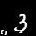

### Embedded MNIST

This dataset was created using images from ImageNet and pasting MNIST digits into the images. The digit's intensity value was adapted according to the mean and standard deviation of the respective ImageNet image that it was pasted in. The image dimensions are 59x100x3.

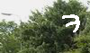

## Results

In the Results folder, some results of each model are presented. If desired, I can also provide the trained models files (which were also not uploaded due to space requirements).

### DRAD

At each timepoint, a new attention patch is computed (blue rectangle). In the end the highest confidence patch is chosen as the localization (yellow rectangle), which in this case was the last timestep.

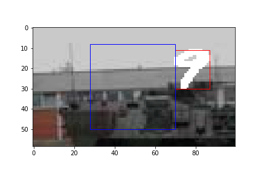 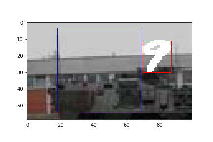 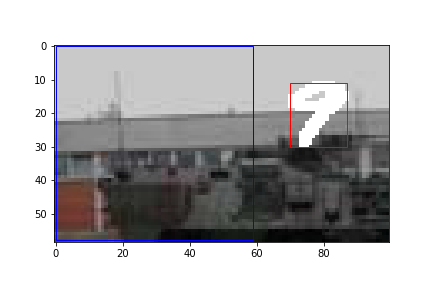 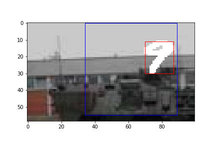 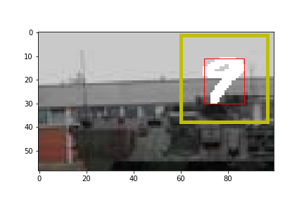
 
### Self Transfer

For each image, the maximum activation for the chosen class is backtracked to an input pixel. A blob of certain radius is drawn in to visualize the localization result.

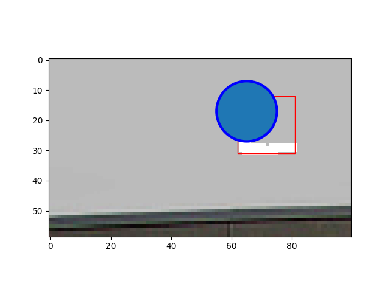 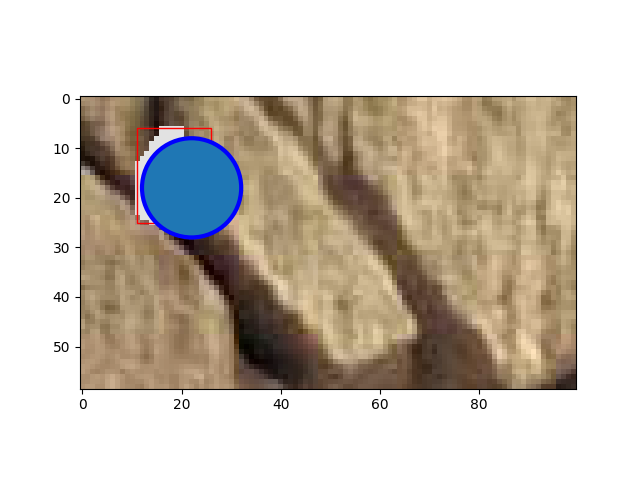 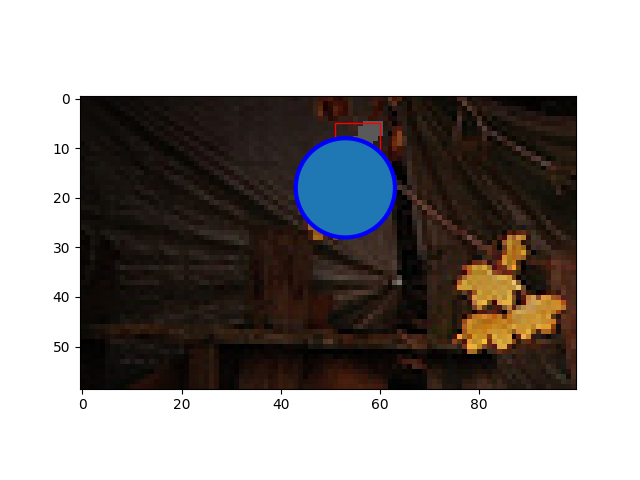
